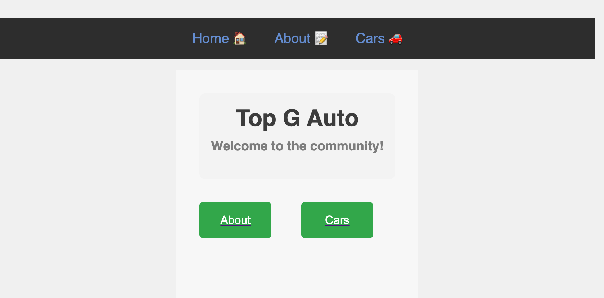

## Date: 02/09/2023

### By: Jonshea Nutson

#### [GitHub](https://github.com/yuurierusan) | [LinkedIn](https://linkedin.com/jonshean)

---

### **_Description_**

#### This project features a beautiful website of classic classic cars modified and made 1 of 1. The website also features the buyers, when they took delivery, and a short statement from each about their car.

---

### **_Technologies Used_**

-   Warp Terminal
-   VS Code
-   MongoDB
-   Insomnia
-   Heroku

1. Github
2. Trello
3. Lucid

---

### **_Getting Started_**

##### Once the site is complete you'll be able to access and marvel at these magnificent cars with the car community [here](TBA).

##### A Trello board was used to keep track of development progress and can be viewed [here](https://trello.com/invite/b/OPazj8RS/ATTI83b09a03dd5606e6c8d2472303eb86a850A2BF6D/top-g-auto).

##### The project itself was deployed and can be viewed [here](https://github.com/yuurierusan/Top-G-Auto-App).

---

### **_Screenshots_**

---

### **_Task List_**

-   [x] Make a Trello to keep track of things
-   [x] Make an Entity Relation Diagram
-   [x] Make a component Diagram
-   [x] Make Read Me
-   [x] Make Rep & Deploy ReadMe
-   [x] Build BackEnd
-   [x] Build FrontEnd
-   [x] Install Dependencies
-   [x] CSS
-   [x] Come up with a pleasant and user friendly colorway
-   [ ] More TBA

---

### **_Future Features_**

-   [ ] Ability to delete cars
-   [ ] Ability to login in and see all your cars and projects
-   [ ] Ability to like and follow others
-   [ ] Ability to share a link to the car or project
-   [ ] Ability to invite people to the community

---
